# 🧭 Estrutura de Domínios

## 🟡 Core Domains (Domínios Principais)

Esses são os domínios que representam a vantagem competitiva central do HubWork. Devem receber prioridade em termos de design, tecnologia e recursos.

---

### 1. **Inteligência de Mercado**
Transforma dados de projetos em insights acionáveis para freelancers e contratantes.

**Subdomínios:**
- Radar de Oportunidades Emergentes  
- Relatórios de Tendência e Demanda  
- Análise de Orçamento por Tipo de Projeto  
- Análise de Gaps e Habilidades em Alta  
- Benchmark de Projetos para Contratantes  

---

### 2. **Recomendação & Matchmaking**
Responsável por conectar projetos e freelancers com base em compatibilidade e comportamento.

**Subdomínios:**
- Match Automático entre Projetos e Perfis  
- Sugestões Personalizadas com base no Histórico  
- Avaliação de Concorrência em Tempo Real  
- Monitoramento de Prazo de Projetos  
- Busca Avançada com Filtros  

---

### 3. **Gestão de Perfis**
Gerencia e aprimora o posicionamento dos usuários na plataforma.

**Subdomínios:**
- Análise e Feedback do Perfil do Freelancer  
- Perfil Estratégico com Nichos Recomendados  
- Histórico de Desempenho e Taxa de Sucesso  
- Segmentação de Personas e Comportamento  

---

### 4. **Propostas e Comunicação Inteligente**
Utiliza IA generativa e análise de linguagem para melhorar a comunicação entre freelancers e contratantes.

**Subdomínios:**
- Geração Automática de Propostas com IA  
- Ajuste de Linguagem com Base em Dados  
- Análise de Sentimento de Contratantes  
- Histórico e Versionamento de Propostas  

---

## 🔵 Supporting Domains (Domínios de Suporte)

Apoiam os domínios centrais, mas não são exclusivos ou diferenciadores do negócio.

---

### 5. **Integração com Plataformas Externas**
Coleta e sincroniza dados de sites como Workana, Freelancer, GetNinjas e Fiverr.

**Subdomínios:**
- Scraping e Coleta de Projetos em Tempo Real  
- Normalização e Categorização de Dados  
- Atualização Automática de Projetos  
- Monitoramento de Conectividade  

---

### 6. **Visualização e Relatórios**
Entrega dados analíticos em formatos visuais úteis e acionáveis.

**Subdomínios:**
- Dashboards Customizados por Perfil  
- Relatórios Exportáveis (CSV, JSON)  
- Indicadores-Chave de Mercado  
- Comparativos e Visualizações Interativas  

---

## ⚪ Generic Domain (Domínio Genérico)

Esses domínios são necessários, mas não diferenciam o produto e podem ser reutilizados em outros contextos.

---

### 7. **Orquestração da Jornada do Usuário**
Personaliza a experiência conforme o momento, perfil e comportamento do usuário.

**Subdomínios:**
- Onboarding Inteligente e Progressivo  
- Ativação e Sugestão de Funcionalidades  
- Mapeamento de Jornada de Freelancer e Contratante  
- Controle de Experimentos e Funcionalidades Beta  

---

## 🔷 Diagrama

```mermaid
%%{init: {'theme': 'neo', 'flowchart': {'curve': 'basis'}}}%%
graph LR
    subgraph Core_Domains
        InteligenciaMercado(["🎯 Inteligência de Mercado"])
        Matchmaking(["🤝 Recomendação & Matchmaking"])
        GestaoPerfis(["🧑‍💼 Gestão de Perfis"])
        PropostasComunicacao(["💬 Propostas e Comunicação"])
    end

    subgraph Supporting_Domains
        IntegracaoPlataformas(["🔗 Integração com Plataformas"])
        VisualizacaoRelatorios(["📊 Visualização e Relatórios"])
    end

    subgraph Generic_Domain
        OrquestracaoJornada(["🧭 Orquestração da Jornada do Usuário"])
    end

    %% Relacionamentos entre domínios
    IntegracaoPlataformas --> InteligenciaMercado
    IntegracaoPlataformas --> Matchmaking
    IntegracaoPlataformas --> GestaoPerfis
    IntegracaoPlataformas --> PropostasComunicacao

    InteligenciaMercado --> VisualizacaoRelatorios
    GestaoPerfis --> Matchmaking
    Matchmaking --> PropostasComunicacao

    OrquestracaoJornada --> GestaoPerfis
    OrquestracaoJornada --> Matchmaking
    OrquestracaoJornada --> InteligenciaMercado
    OrquestracaoJornada --> PropostasComunicacao

    VisualizacaoRelatorios --> Contratante(["🧑‍💼 Contratante"])
    Matchmaking --> Freelancer(["👨‍💻 Freelancer"])
    PropostasComunicacao --> Freelancer
```
