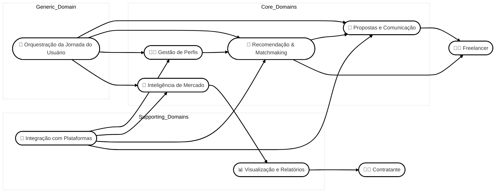

# Descrição

# HubWork – Inteligência para o Mercado Freelancer

O **HubWork** é uma plataforma inteligente que transforma a forma como **freelancers e contratantes se conectam, tomam decisões e atuam no mercado**. Integrando dados de sites como *Workana, Freelancer, Fiverr* e *GetNinjas*, o HubWork coleta, estrutura e analisa milhares de projetos em tempo real para oferecer **insights acionáveis, recomendações personalizadas e automação estratégica**.

## Para freelancers

O HubWork funciona como um **copiloto profissional**. Ele:

- Identifica oportunidades alinhadas ao seu perfil.
- Antecip​a tendências de mercado.
- Automatiza a criação de propostas com inteligência artificial.

Com análises sobre **orçamento**, **concorrência** e **perfis de contratantes**, o freelancer pode:

- Se posicionar melhor.
- Economizar tempo.
- Aumentar sua taxa de sucesso.

## Para contratantes

A plataforma oferece uma **visão clara e estratégica** do mercado freelancer. É possível:

- Entender custos por tipo de serviço.
- Identificar lacunas de oferta.
- Acompanhar comportamentos e tendências.

Tudo isso para realizar contratações mais **eficientes e inteligentes**.

## Principais diferenciais

- ✅ Matchmaking automático entre perfis e projetos  
- ✅ Sugestões personalizadas baseadas em comportamento e histórico  
- ✅ Radar de oportunidades emergentes e tendências  
- ✅ Geração automática de propostas com IA generativa  
- ✅ Análises profundas sobre orçamento, concorrência e perfis de contratantes  
- ✅ Relatórios completos sobre demanda de mercado e habilidades em alta  
- ✅ Integração com as principais plataformas de freelancing  

---

**Com o HubWork, dados viram estratégia — e estratégia vira vantagem competitiva.**

---

# Como Funciona

# Como o HubWork funciona

O **HubWork** funciona como uma **plataforma de inteligência** que transforma **dados brutos do mercado freelancer em decisões estratégicas** para freelancers e contratantes. Tudo começa com a **coleta automatizada de informações** de plataformas como *Workana, Freelancer, Fiverr* e *GetNinjas*.

---

## 💡 1. Coleta de Dados em Tempo Real

Utilizamos tecnologia de **scraping inteligente** para extrair milhares de projetos postados nessas plataformas:

- descrições,
- habilidades requeridas,
- orçamentos,
- prazos,
- comportamento dos contratantes.

---

## 🔍 2. Organização e Estruturação

Esses dados são **processados, limpos e categorizados** por meio de algoritmos e inteligência artificial, formando uma base rica e atualizada de:

- oportunidades,
- perfis,
- tendências.

---

## 🤖 3. Geração de Inteligência com IA

Aplicamos modelos de **IA generativa e análise preditiva** para:

- gerar recomendações personalizadas,  
- criar propostas automáticas,  
- identificar nichos promissores,  
- calcular faixas de orçamento por tipo de projeto,  
- interpretar o tom de comunicação dos contratantes.

---

## ✨ 4. Entrega de Valor Personalizado

Cada usuário acessa funcionalidades de acordo com seu **perfil e momento da jornada**:

- **Freelancers** recebem sugestões de projetos compatíveis, feedback sobre o mercado e automações para economizar tempo.  
- **Contratantes** acessam relatórios, benchmarks e análises para contratar com mais confiança.

---

## 🔗 5. Integração com as plataformas

Tudo isso acontece de forma **integrada e transparente**, sem que o usuário precise navegar por múltiplos sites.

O **HubWork centraliza as oportunidades e análises em um só lugar**.

---

---

# Glossario

# 📚 Glossário de Domínio

| Termo                    | Definição                                                                                  |
|--------------------------|--------------------------------------------------------------------------------------------|
| **Freelancer**           | Profissional autônomo que busca projetos em plataformas como Workana, Fiverr, Freelancer e GetNinjas. |
| **Contratante**          | Empresa ou pessoa que publica projetos e contrata freelancers.                            |
| **Projeto**              | Demanda publicada por um contratante, contendo descrição, habilidades requeridas, orçamento e prazo. |
| **Proposta**             | Documento enviado por um freelancer se candidatando a um projeto. Pode ser gerada automaticamente pelo sistema. |
| **Recomendação**         | Sugestão automatizada de projeto que combina com o perfil e histórico do freelancer.       |
| **Matchmaking**          | Processo de cruzamento entre características de freelancers e projetos para sugerir boas combinações. |
| **Perfil do Freelancer** | Conjunto de informações sobre o profissional, incluindo portfólio, habilidades, experiência, avaliações e histórico. |
| **Perfil Estratégico**   | Análise do desempenho e posicionamento do freelancer, com sugestões de nichos e pontos de melhoria. |
| **Radar de Oportunidades** | Funcionalidade que identifica tendências emergentes em projetos recentes para antecipar demandas. |
| **Análise de Sentimento** | Interpretação automática do tom de mensagens de contratantes, identificando intenção e estilo de comunicação. |
| **Orçamento Médio**      | Valor calculado com base em dados históricos de projetos similares, usado como referência de precificação. |
| **Concorrência de Projeto** | Quantidade de propostas já enviadas para um projeto e seu nível de visibilidade.         |
| **Tendência de Mercado** | Padrão identificado em dados que indica aumento na demanda por categorias, habilidades ou tipos de serviço. |
| **Benchmark**            | Comparativo baseado em dados reais que ajuda contratantes a entender o escopo e custo esperado de projetos. |
| **Análise de Perfil**    | Avaliação do perfil do freelancer com foco em melhoria contínua, atratividade e aderência ao mercado. |
| **Jornada do Usuário**   | Sequência de ações e interações realizadas por freelancers ou contratantes ao usar a plataforma. |
| **Sugestão Personalizada** | Recomendação baseada no histórico de navegação, preferências e comportamento anterior do usuário. |
| **Dashboards e Relatórios** | Visualizações de dados estratégicos sobre o mercado freelancer, tendências e comportamento. |
| **Scraping**             | Técnica de coleta automatizada de dados estruturados de plataformas externas.              |
| **Plataformas Externas** | Sites integrados com o HubWork, como Workana, Fiverr, GetNinjas e Freelancer.              |
| **Comportamento do Usuário** | Conjunto de ações realizadas por um usuário dentro da plataforma, como buscas, cliques e propostas enviadas. |
| **Habilidade em Alta**   | Competência profissional que apresenta aumento significativo de demanda.                  |
| **Gap de Mercado**       | Área ou habilidade com alta demanda e pouca oferta de profissionais qualificados.         |
| **Faixa de Preço**       | Variação média de orçamento praticado para determinado tipo de serviço ou projeto.         |

---

# Personas

# Personas

## Freelancer

**Perfil:**  
Profissionais autônomos que prestam serviços via plataformas como Workana, Freelancer, Fiverr, etc., e querem otimizar sua busca por oportunidades e aumentar suas chances de contratação.

**Motivações:**
- Encontrar projetos compatíveis com suas habilidades com rapidez.
- Aumentar a taxa de sucesso nas propostas enviadas.
- Precificar melhor seus serviços.
- Se posicionar de forma mais estratégica no mercado.

**Funcionalidades que atendem:**
- Matchmaking automático de projetos.
- Geração de propostas com IA.
- Perfil estratégico com insights sobre pontos fortes e nichos lucrativos.
- Radar de Oportunidades Emergentes.
- Feedback sobre projetos competitivos.
- Análise de orçamento por tipo de projeto.
- Análise de Sentimento de Contratantes.
- Monitoramento de prazos.
- Busca avançada.
- Sugestões personalizadas com base no histórico.

**Subtipos possíveis:**
- Freelancer iniciante buscando orientação.
- Freelancer experiente buscando escalar ou mudar de nicho.
- Especialistas técnicos (programadores, designers, redatores, etc.)

---

## Contratante

**Perfil:**  
Pequenas e médias empresas, startups ou empreendedores que contratam freelancers para projetos específicos e querem tomar decisões mais embasadas.

**Motivações:**
- Entender melhor o mercado freelancer antes de publicar um projeto.
- Saber quanto custa determinado tipo de trabalho.
- Saber quais habilidades estão em alta ou em falta.
- Acompanhar concorrência e tendências para ajustar suas contratações.

**Funcionalidades que atendem:**
- Relatórios de tendências de mercado.
- Análise de demanda e tipos de serviços procurados.
- Análise de orçamento por categoria.
- Análise de perfil de freelancers (para avaliar candidatos).
- Integração com plataformas (para acompanhar projetos postados).
- Insights estratégicos sobre comportamento do mercado.

**Subtipos possíveis:**
- Dono de startup buscando freelancers recorrentes.
- Gestor de marketing ou produto contratando sob demanda.
- PMs ou founders que precisam de benchmarks de orçamento.

---

# Dominios

# 🧭 Estrutura de Domínios

## 🟡 Core Domains (Domínios Principais)

Esses são os domínios que representam a vantagem competitiva central do HubWork. Devem receber prioridade em termos de design, tecnologia e recursos.

---

### 1. **Inteligência de Mercado**
Transforma dados de projetos em insights acionáveis para freelancers e contratantes.

**Subdomínios:**
- Radar de Oportunidades Emergentes  
- Relatórios de Tendência e Demanda  
- Análise de Orçamento por Tipo de Projeto  
- Análise de Gaps e Habilidades em Alta  
- Benchmark de Projetos para Contratantes  

---

### 2. **Recomendação & Matchmaking**
Responsável por conectar projetos e freelancers com base em compatibilidade e comportamento.

**Subdomínios:**
- Match Automático entre Projetos e Perfis  
- Sugestões Personalizadas com base no Histórico  
- Avaliação de Concorrência em Tempo Real  
- Monitoramento de Prazo de Projetos  
- Busca Avançada com Filtros  

---

### 3. **Gestão de Perfis**
Gerencia e aprimora o posicionamento dos usuários na plataforma.

**Subdomínios:**
- Análise e Feedback do Perfil do Freelancer  
- Perfil Estratégico com Nichos Recomendados  
- Histórico de Desempenho e Taxa de Sucesso  
- Segmentação de Personas e Comportamento  

---

### 4. **Propostas e Comunicação Inteligente**
Utiliza IA generativa e análise de linguagem para melhorar a comunicação entre freelancers e contratantes.

**Subdomínios:**
- Geração Automática de Propostas com IA  
- Ajuste de Linguagem com Base em Dados  
- Análise de Sentimento de Contratantes  
- Histórico e Versionamento de Propostas  

---

## 🔵 Supporting Domains (Domínios de Suporte)

Apoiam os domínios centrais, mas não são exclusivos ou diferenciadores do negócio.

---

### 5. **Integração com Plataformas Externas**
Coleta e sincroniza dados de sites como Workana, Freelancer, GetNinjas e Fiverr.

**Subdomínios:**
- Scraping e Coleta de Projetos em Tempo Real  
- Normalização e Categorização de Dados  
- Atualização Automática de Projetos  
- Monitoramento de Conectividade  

---

### 6. **Visualização e Relatórios**
Entrega dados analíticos em formatos visuais úteis e acionáveis.

**Subdomínios:**
- Dashboards Customizados por Perfil  
- Relatórios Exportáveis (CSV, JSON)  
- Indicadores-Chave de Mercado  
- Comparativos e Visualizações Interativas  

---

## ⚪ Generic Domain (Domínio Genérico)

Esses domínios são necessários, mas não diferenciam o produto e podem ser reutilizados em outros contextos.

---

### 7. **Orquestração da Jornada do Usuário**
Personaliza a experiência conforme o momento, perfil e comportamento do usuário.

**Subdomínios:**
- Onboarding Inteligente e Progressivo  
- Ativação e Sugestão de Funcionalidades  
- Mapeamento de Jornada de Freelancer e Contratante  
- Controle de Experimentos e Funcionalidades Beta  

---

## 🔷 Diagrama

---

# Funcionalidades

# Funcionalidades

1. **Matchmaking automático entre freelancers e projetos**  
   Identifica e recomenda, de forma inteligente, os projetos mais compatíveis com as habilidades, experiências anteriores e portfólio do freelancer, reduzindo o tempo gasto em buscas manuais e aumentando as chances de sucesso.

2. **Sugestões personalizadas de projetos**  
   Gera recomendações automáticas com base no comportamento do usuário, histórico de aplicações, categorias favoritas e tipos de trabalho mais acessados, oferecendo uma experiência cada vez mais personalizada.

3. **Radar de Oportunidades Emergentes**  
   Detecta tendências de mercado em tempo real por meio da análise de dados e padrões linguísticos em projetos recentes, destacando novas áreas de alta demanda para que freelancers se antecipem e se posicionem estrategicamente.

4. **Perfil Estratégico do Freelancer**  
   Analisa o desempenho do freelancer em propostas e projetos anteriores para sugerir um direcionamento de posicionamento, identificando nichos mais lucrativos, pontos fortes e oportunidades de melhoria no portfólio.

5. **Análise de Sentimento de Contratantes**  
   Utiliza inteligência artificial para interpretar o tom e a intenção por trás das descrições de projetos e mensagens de contratantes, permitindo ao freelancer avaliar o estilo de comunicação e o nível de exigência do cliente antes de enviar uma proposta.

6. **Geração automática de propostas**  
   Cria propostas personalizadas com base na descrição do projeto e no perfil do freelancer, utilizando IA generativa para redigir textos relevantes, profissionais e alinhados às expectativas do contratante.

7. **Relatórios de tendências de mercado**  
   Produz visualizações e insights sobre as áreas, categorias e habilidades mais demandadas nas plataformas de freelancing, auxiliando freelancers e empresas a acompanharem o movimento do mercado e ajustarem suas estratégias.

8. **Análise de orçamento por tipo de projeto**  
   Compila dados de milhares de projetos para calcular faixas de preços médias por categoria, nível de complexidade e tempo estimado, ajudando freelancers a precificarem seus serviços de forma mais competitiva e estratégica.

9. **Feedback sobre projetos competitivos**  
   Informa o nível de concorrência em tempo real de cada projeto, destacando o número de propostas já enviadas, nível de visibilidade e potencial de retorno, para que o freelancer escolha com mais inteligência onde aplicar.

10. **Relatórios sobre demanda de mercado**  
   Oferece dados estruturados sobre os tipos de serviços mais procurados, perfis de contratantes mais ativos, e variações de orçamento, auxiliando na identificação de oportunidades de alto potencial.

11. **Busca avançada de projetos**  
   Permite aplicar múltiplos filtros como palavras-chave, orçamento, categoria, habilidades requeridas, prazo e experiência desejada, facilitando a localização precisa de oportunidades alinhadas ao perfil do usuário.

12. **Monitoramento do tempo restante de projetos**  
   Exibe contagens regressivas para o encerramento de propostas em projetos populares, ajudando freelancers a não perderem prazos críticos e a organizarem melhor sua rotina de envio.

13. **Análise de perfil de freelancers**  
   Avalia aspectos do perfil do usuário como portfólio, descrição, habilidades e avaliações, oferecendo sugestões práticas para aumentar sua atratividade e competitividade nas plataformas.

14. **Integração com plataformas de freelance**  
   Conecta-se diretamente a sites como GetNinjas, Freelancer, Workana e Fiverr para realizar a coleta, organização e atualização automatizada dos dados de projetos, centralizando tudo em um único ambiente.

---

# Requisitos Funcionais

# Requisitos Funcionais

## 🔁 Recomendação e Match

- O sistema deve sugerir projetos que combinem com o perfil do freelancer.
- O sistema deve mostrar projetos com base no que o usuário costuma buscar e acessar.

---

## 📈 Inteligência de Mercado

- O sistema deve mostrar tendências e áreas em alta no mercado freelancer.
- O sistema deve gerar relatórios sobre as categorias e habilidades mais procuradas.
- O sistema deve informar quais serviços estão sendo mais contratados.
- O sistema deve mostrar valores médios por tipo de projeto.

---

## 🧠 Análise de Perfil

- O sistema deve dar sugestões para o freelancer se posicionar melhor no mercado.
- O sistema deve analisar o perfil do freelancer e dar dicas de melhoria.
- O sistema deve dar feedback com base no desempenho das propostas.

---

## 💬 Propostas e Comunicação

- O sistema deve criar propostas automáticas com IA.
- O sistema deve permitir que o usuário ajuste o texto da proposta.
- O sistema deve analisar o tom das mensagens dos contratantes.

---

## 🔎 Busca de Projetos

- O sistema deve permitir buscar projetos com filtros (como orçamento, prazo, categoria).
- O sistema deve mostrar quanto tempo falta para o envio de propostas.
- O sistema deve informar se há muita concorrência em um projeto.

---

## 🔗 Integração com Plataformas

- O sistema deve se conectar com sites como Workana, Freelancer, Fiverr e GetNinjas para buscar dados.
- O sistema deve organizar e atualizar os dados coletados.

---

## 📊 Ajuda para Contratantes

- O sistema deve mostrar referências de preço para ajudar na hora de planejar projetos.
- O sistema deve mostrar tendências e lacunas no mercado.
- O sistema deve ajudar contratantes a avaliar freelancers com base em dados.

---

# Requisitos Não Funcionais

# Requisitos Não Funcionais

## ⚡ Desempenho

- O sistema deve processar e analisar grandes volumes de dados em tempo real.
- O tempo de resposta para recomendações e relatórios não deve exceder 2 segundos.
- O sistema deve suportar ao menos 10.000 usuários ativos simultaneamente sem perda de desempenho.

---

## 🚀 Escalabilidade

- O sistema deve permitir escalabilidade horizontal para lidar com o crescimento de usuários e dados.
- Deve ser possível adicionar novos recursos de infraestrutura sem impactar a experiência do usuário.

---

## 🔒 Segurança

- Todas as comunicações devem ser criptografadas via TLS 1.3 ou superior.
- Dados sensíveis dos usuários devem ser armazenados de forma segura e protegidos contra acessos não autorizados.
- O sistema deve oferecer autenticação multifator (MFA) para maior proteção das contas.

---

## ✅ Confiabilidade

- O sistema deve garantir disponibilidade de pelo menos 99,9%.
- Deve haver mecanismos automáticos de failover e recuperação em caso de falhas.

---

## 💡 Usabilidade

- A interface deve ser intuitiva, moderna e responsiva, adaptando-se a diferentes dispositivos e tamanhos de tela.
- O sistema deve seguir diretrizes de acessibilidade como WCAG 2.1 para garantir inclusão.

---

## 🧰 Manutenibilidade

- O sistema deve ter arquitetura modular e código bem documentado para facilitar atualizações.
- A introdução de novas funcionalidades não deve comprometer as existentes.

---

## 🌐 Compatibilidade

- O sistema deve ser compatível com os principais navegadores modernos (Chrome, Firefox, Safari, Edge).
- A plataforma deve funcionar corretamente em diferentes sistemas operacionais e dispositivos.

---

## 🔁 Portabilidade

- A arquitetura do sistema deve permitir migração entre provedores de nuvem (AWS, Azure, GCP).
- Backups e restaurações de dados devem ser simples, frequentes e confiáveis.

---

## 🔗 Interoperabilidade

- O sistema deve permitir integração com APIs de terceiros, como plataformas de freelance, ferramentas de comunicação e serviços de pagamento.
- Deve ser possível exportar dados em formatos padrão como CSV, JSON e XML.

---

## 📜 Legalidade e Conformidade

- O sistema deve estar em conformidade com a LGPD (Brasil), GDPR (UE) e demais legislações de proteção de dados aplicáveis.
- O usuário deve ter controle sobre seus dados e consentimento explícito para o uso de informações pessoais.

---

---

